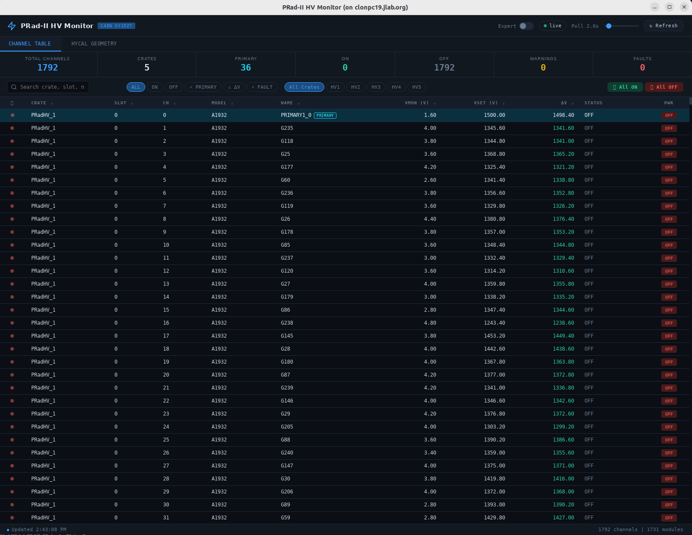

# PRad-II HV Monitor

A real-time high-voltage monitoring and control system for the PRad-II experiment's HyCal electromagnetic calorimeter. It communicates with CAEN SY1527 mainframes over TCP/IP and presents a live dashboard in a Qt WebEngine window.

## Overview

The HyCal calorimeter consists of ~1200 detector modules (PbWO4 crystals and PbGlass blocks), each powered by individual HV channels distributed across multiple CAEN SY1527 crates. This application provides three operating modes:

- **GUI mode** (default) — launches an interactive web-based dashboard with live voltage readback, per-channel power and voltage control, and a 2D geometry map of the full detector.
- **Read mode** — performs a one-shot console readout of all channel voltages, optionally saving to a file.
- **Write mode** — restores channel voltages from a previously saved settings file.

## Features

### Channel Table
- Live-updating table of all HV channels across all crates with sortable columns (crate, slot, channel, model, name, VMon, VSet, ΔV, status).


### HyCal Geometry Map
- Interactive 2D canvas view of all detector modules in their physical positions (mm coordinates).
- Clicking a module on the geometry map opens a draggable floating popup.


## Get Started

### Dependencies

- **C++17** compiler (GCC 7+ or Clang 5+)
- **CMake** 3.11+
- **Qt 5** with modules: Core, Widgets, WebEngineWidgets, WebChannel
- **CAENHVWrapper** shared library (`libcaenhvwrapper.so`, included in `caen_lib/`)
- **fmt** (fetched automatically via CMake FetchContent)

### Building

```bash
mkdir build && cd build
cmake .. -DCMAKE_PREFIX_PATH=/path/to/Qt5/lib/cmake
make -j$(nproc)
```

If Qt5 is installed system-wide, the `-DCMAKE_PREFIX_PATH` flag can be omitted.

The binary is placed in `build/bin/prad2hvmon`. Resource files are located automatically relative to the binary, or from the `RESOURCE_DIR` compile-time path.

### GUI Mode (default)

```bash
./prad2hvmon
./prad2hvmon gui
./prad2hvmon gui -p 3000                    # set poll interval to 3000 ms
./prad2hvmon gui -m /path/to/modules.json   # custom module geometry
./prad2hvmon gui -c /path/to/crates.json    # custom crate config
```

### Read Mode

```bash
./prad2hvmon read                           # print all channels to stdout
./prad2hvmon read -s snapshot.txt           # also save to file
```

### Write Mode

```bash
./prad2hvmon write -f settings.txt          # restore voltages from file
```

### Command-Line Options

| Option | Description |
|--------|-------------|
| `-c <file>` | Path to crates JSON config file (default: auto-discover) |
| `-f <file>` | Path to channel voltage-setting file (write mode) |
| `-s <file>` | Path to save channel readings (read mode) |
| `-p <ms>` | Poll interval in milliseconds for GUI mode (default: 2000) |
| `-m <file>` | Path to module geometry JSON file (GUI mode) |
| `-h` | Show help message |

## Configuration

### Crate Addresses (`resources/crates.json`)

Defines the CAEN SY1527 crates to connect to. Edit this file to add, remove, or re-address crates without recompiling:

```json
[
    {"name": "PRadHV_1", "ip": "129.57.160.67"},
    {"name": "PRadHV_2", "ip": "129.57.160.68"},
    {"name": "PRadHV_3", "ip": "129.57.160.69"},
    {"name": "PRadHV_4", "ip": "129.57.160.70"},
    {"name": "PRadHV_5", "ip": "129.57.160.71"}
]
```

Each entry requires a `name` (used as the crate identifier throughout the system) and an `ip` (the TCP/IP address of the SY1527 mainframe).

### GUI Configuration (`resources/gui_config.json`)

Controls the initial window size, ΔV warning thresholds, geometry color scale ranges, and geometry canvas extent:

```json
{
    "window": {
        "width": 1600,
        "height": 1200
    },
    "deltaV": {
        "warn_threshold": 2.0,
        "table_ok":       0.5,
        "table_warn":     2.0,
        "geo_excellent":  0.2,
        "geo_good":       1.0,
        "geo_warn":       3.0,
        "geo_bad":        10.0
    },
    "colorRange": {
        "vmon_max": 2100,
        "vset_max": 2100
    },
    "geoView": {
        "extent": 600
    }
}
```

| Section | Key | Description |
|---------|-----|-------------|
| `window` | `width` / `height` | Initial Qt window size in pixels |
| `deltaV` | `warn_threshold` | ΔV above this triggers a warning (filter chip and summary count) |
| `deltaV` | `table_ok` / `table_warn` | ΔV color thresholds for table rows (green / amber / red) |
| `deltaV` | `geo_excellent` / `geo_good` / `geo_warn` / `geo_bad` | Color band thresholds for the geometry ΔV view |
| `colorRange` | `vmon_max` / `vset_max` | Upper bound of the voltage color scale in geometry VMon/VSet views |
| `geoView` | `extent` | Half-width of the geometry canvas in mm (controls initial zoom-to-fit) |

### Module Geometry (`resources/hycal_modules.json`)

A JSON array of module entries:

```json
{"n": "G235", "t": "PbGlass", "sx": 38.15, "sy": 38.15, "x": 372.165, "y": 276.725}
```

| Field | Description |
|-------|-------------|
| `n` | Module name (must match the CAEN channel name for automatic HV linkage) |
| `t` | Module type: `PbGlass`, `PbWO4`, or `LMS` |
| `sx`, `sy` | Module size in mm |
| `x`, `y` | Center position in mm |

The geometry map links each module to its live HV data by matching the `"n"` field against CAEN channel names. At each poll cycle, the backend reads all channel names from the hardware and the frontend builds a lookup table (`chByName`) keyed by channel name. When rendering the geometry, each module's `"n"` value is looked up in this table to retrieve its VMon, VSet, power status, and fault state. The `"n"` field must exactly match the channel name programmed into the CAEN crate — no separate mapping file is needed.

Virtual blocks for auxiliary channels (e.g. LMS) can be added with positions outside the main detector footprint and will be linked automatically through the same name-matching mechanism.

### Voltage Settings Files

The read/write modes use a whitespace-delimited text format:

```
#      crate    slot channel            name      VMon      VSet
    PRadHV_1       0       0      PRIMARY1_0    1490.8      1500
    PRadHV_1       0       1            G235    1477.8      1500
```

## Architecture

The application uses a C++ backend with a web frontend connected via Qt WebChannel:

```
┌──────────────────────┐     QWebChannel      ┌──────────────────────────┐
│   CAEN SY1527        │◄──── TCP/IP ────►    │   HVMonitor              │
│   HV Crates          │                      │   (QObject)              │
└──────────────────────┘                      │                          │
                                              │  readAll()               │
                                              │  getTopology()           │
                                              │  setChannelPower()       │
                                              │  setAllPower()           │
                                              │  setChannelVoltage()     │
                                              │  setChannelName()        │
                                              │  setPollInterval()       │
                                              │  getPollInterval()       │
                                              │  getModuleGeometry()     │
                                              │  getGuiConfig()          │
                                              │  channelsUpdated ───────►│
                                              └──────────┬───────────────┘
                                                         │ JSON
                                                         ▼
                                              ┌──────────────────────────┐
                                              │   monitor.html/js/css    │
                                              │   (JS frontend)          │
                                              │                          │
                                              │  Channel Table           │
                                              │  HyCal Geometry Map      │
                                              │  Expert Mode Controls    │
                                              │  Module Popups           │
                                              └──────────────────────────┘
```

The `HVMonitor` QObject polls all crates on a configurable timer and emits `channelsUpdated(jsonStr)` each cycle. The JS frontend parses the JSON, updates the table and geometry map, and calls back into C++ slots for power, voltage, and name control. Crate definitions are loaded at startup from `crates.json`, parsed using Qt's built-in `QJsonDocument`. If crates fail to connect at startup the dashboard still launches and shows partial data.

## Channel Types

| Name Pattern | Type | Voltage Limit | Description |
|-------------|------|---------------|-------------|
| `G*` | PbGlass | 1950 V | Lead glass calorimeter modules |
| `W*` | PbWO4 | 1450 V | Lead tungstate crystal modules |
| `PRIMARY*` | Primary | 3000 V | Board-level power/limit control (channel 0 on A1932 boards) |
| `L*` (LMS) | LMS | 2000 V | Light Monitoring System reference PMTs |
| `S*` / `SCIN*` | Scintillator | 2000 V | Scintillator counters |
| `H*` | Veto | 2000 V | PrimEx veto counter channels |

Voltage limits are enforced by `CAEN_VoltageLimit()` in `caen_lib/caen_channel.cpp`. Channels with unrecognised name prefixes default to 1500 V.

## Author

Chao Peng — Argonne National Laboratory
