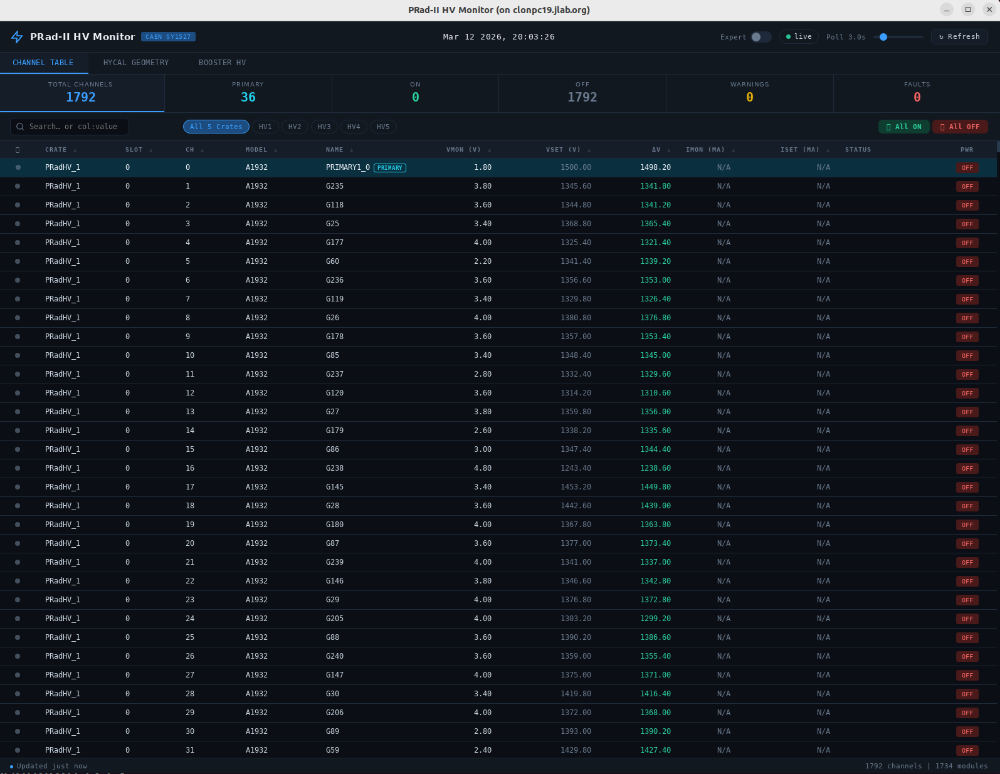
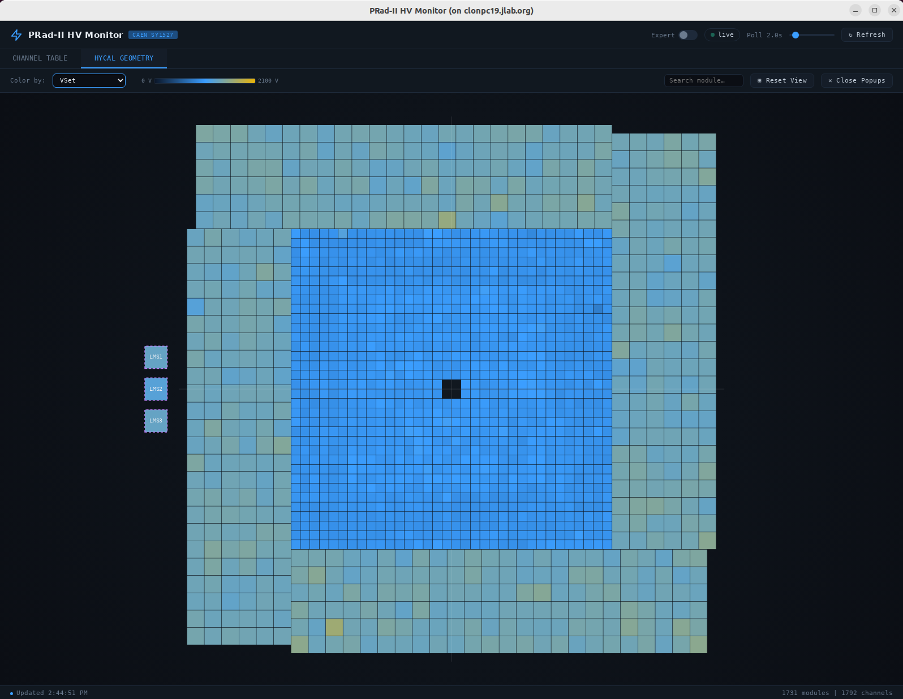
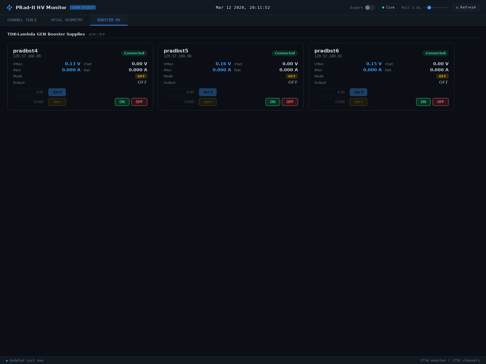

# PRad-II HV Monitor

A real-time high-voltage monitoring and control system for the PRad-II experiment's HyCal electromagnetic calorimeter. It communicates with CAEN SY1527 mainframes over TCP/IP, and with TDK-Lambda GEN booster supplies via SCPI/TCP, presenting a live dashboard in a Qt WebEngine window.

## Overview

The HyCal calorimeter consists of ~1200 detector modules (PbWO4 crystals and PbGlass blocks), each powered by individual HV channels distributed across multiple CAEN SY1527 crates. This application provides three operating modes:

- **GUI mode** (default) — launches an interactive web-based dashboard with live voltage readback, per-channel power and voltage control, a 2D geometry map of the full detector, and a dedicated booster HV panel.
- **Read mode** — performs a one-shot console readout of all channel voltages, optionally saving to a file.
- **Write mode** — restores channel voltages from a previously saved settings file.

## Features

### Channel Table
- Live-updating table of all HV channels across all crates with sortable columns (crate, slot, channel, model, name, VMon, VSet, ΔV, IMon, ISet, status).
- Crate filter chips update dynamically as crates connect; a summary strip shows total, primary, ON, OFF, warning, and fault counts.
- Per-channel inline VSet editing and power toggle. Bulk ON/OFF applies across all visible channels.
- Expert mode (toggle in header) gates write operations — voltage and current setpoints require expert mode; power ON/OFF is always available.



### HyCal Geometry Map
- Interactive 2D canvas view of all detector modules in their physical positions (mm coordinates).
- Color-by selector: VMon, VSet, |VMon − VSet|, or Status.
- Clicking a module opens a draggable floating popup with live readback and controls. Multiple popups can be open simultaneously; all update on every poll cycle.
- Tooltip on hover shows VMon/VSet, IMon/ISet (where supported), DAQ crate/slot/channel, and status.
- DAQ connection info is loaded from `daq_map.json` and displayed alongside HV data.



### Board Status Tab
- Dedicated tab showing per-board hardware information for every slot across all connected crates.
- Columns: Crate, Slot, Model, Ch (channel count), Serial, FW (firmware version), HVMax (V), Temp (°C), and Status.
- Temperature is color-coded: green for the normal 5–40 °C range, amber outside that range, red when temperature-related status flags (UNDRT, OVERT, TCAL) are present.
- Board status shows OK in green or the fault abbreviation in red (with a tooltip for the detail string).
- A red fault dot appears on the Board Status tab button whenever any board reports a non-OK status.

### Booster HV Panel
- Dedicated tab for TDK-Lambda GEN booster power supplies, communicated with via SCPI over TCP.
- **Connection is manual.** On launch the booster tab shows a "Connect to Boosters" overlay. Clicking the button opens TCP connections and starts polling. This avoids locking out other monitor instances by default.
- Once connected, the header bar provides a **Retry** button (disconnect then immediately reconnect) and a **Disconnect** button (release TCP connections so other instances can use them).
- Per-supply cards show: connection status, VMon, VSet, IMon, ISet, operating mode (CV/CC), and output state.
- Controls per card: VSet and ISet inputs (expert mode required), ON/OFF buttons (always available).
- Supply definitions are loaded from `hycal_modules.json` entries with `"t": "booster"`.

> **⚠️ Single-connection limit:** Each TDK-Lambda GEN supply only accepts one TCP connection at a time. If multiple instances of the monitor are running simultaneously, only the first instance to connect will communicate successfully with the boosters. Because connection is now opt-in, you can safely run multiple monitor instances for read-only HV monitoring and only connect to boosters from the one instance that needs it.



### Audible Fault Alarm
- A two-tone beep plays once per poll cycle whenever any channel, board, or booster reports a fault or error.
- The alarm button in the header shows the current state: 🔔 (no faults), ⚠ with fault labels (active), or 🔇 (muted).
- Clicking the alarm button toggles mute. The alarm automatically un-mutes when new faults appear or when all faults clear.
- Red fault indicator dots appear on the Channel Table, Board Status, and Booster HV tab buttons to show which subsystem has active faults.

### Fault Logger
- All fault transitions (channel, board, and booster) are logged to daily rotating files in `<DATABASE_DIR>/fault_log/`.
- Each line is tab-separated: `timestamp  APPEAR|DISAPPEAR  type  name  status`.
- A fault is any non-empty status containing tokens other than the normal operating states (ON, OFF, RUP, RDN).
- The logger is thread-safe and shared between the HV poller and booster poller threads.
- Files rotate automatically at midnight (one file per day, named `YYYY-MM-DD.log`).

## Get Started

### Run it at Hall B Counting Room

The code is already compiled on `clonpc19`. To launch the monitor:
```bash
ssh clasrun@clonpc19
cd ~/prad2_daq/prad2hvmon/build
./bin/prad2hvmon

```

### Dependencies

- **C++17** compiler (GCC 7+ or Clang 5+)
- **CMake** 3.11+
- **Qt 5** with modules: Core, Widgets, WebEngineWidgets, WebChannel
- **CAENHVWrapper** shared library (`libcaenhvwrapper.so`, included in `caen_lib/`)
- **fmt** (fetched automatically via CMake FetchContent)

### Building

```bash
mkdir build && cd build
cmake .. -DCMAKE_PREFIX_PATH=/path/to/Qt5/lib/cmake
make -j$(nproc)
```

If Qt5 is installed system-wide, the `-DCMAKE_PREFIX_PATH` flag can be omitted.

The binary is placed in `build/bin/prad2hvmon`. Resource files are located automatically relative to the binary, or from the `RESOURCE_DIR` compile-time path.

### GUI Mode (default)

```bash
./prad2hvmon
./prad2hvmon gui
./prad2hvmon gui -m /path/to/modules.json   # custom module geometry
./prad2hvmon gui -c /path/to/crates.json    # custom crate config
```

### Taking a Screenshot

Press **Ctrl+S** at any time while the GUI is open to save a full-window PNG snapshot. The file is written to the system Pictures folder (e.g. `~/Pictures/`) with a timestamped name:

```
prad2hvmon_20260312_153042.png
```

If the Pictures folder is unavailable the file is saved to the current working directory instead.

### Read Mode

```bash
./prad2hvmon read                           # print all channels to stdout
./prad2hvmon read -s snapshot.txt           # also save to file
```

### Write Mode

```bash
./prad2hvmon write -f settings.txt          # restore voltages from file
```

### Command-Line Options

| Option | Description |
|--------|-------------|
| `-c <file>` | Path to crates JSON config file (default: auto-discover) |
| `-f <file>` | Path to channel voltage-setting file (write mode) |
| `-s <file>` | Path to save channel readings (read mode) |
| `-m <file>` | Path to module geometry JSON file (GUI mode) |
| `-h` | Show help message |

## Configuration

### Crate Addresses (`database/crates.json`)

Defines the CAEN SY1527 crates to connect to. Edit this file to add, remove, or re-address crates without recompiling:

```json
[
    {"name": "PRadHV_1", "ip": "129.57.160.67"},
    {"name": "PRadHV_2", "ip": "129.57.160.68"},
    {"name": "PRadHV_3", "ip": "129.57.160.69"},
    {"name": "PRadHV_4", "ip": "129.57.160.70"},
    {"name": "PRadHV_5", "ip": "129.57.160.71"}
]
```

Each entry requires a `name` (used as the crate identifier throughout the system) and an `ip` (the TCP/IP address of the SY1527 mainframe).

### GUI Configuration (`database/gui_config.json`)

Controls the initial window size, ΔV warning thresholds, geometry color scale ranges, and geometry canvas extent:

```json
{
    "window": {
        "width": 1600,
        "height": 1200
    },
    "deltaV": {
        "warn_threshold": 2.0,
        "table_ok":       0.5,
        "table_warn":     2.0,
        "geo_excellent":  0.2,
        "geo_good":       1.0,
        "geo_warn":       3.0,
        "geo_bad":        10.0
    },
    "colorRange": {
        "vmon_max": 2100,
        "vset_max": 2100
    },
    "geoView": {
        "extent": 600
    },
    "intervals": {
        "pollMs":   3000,
        "renderMs": 200
    }
}
```

| Section | Key | Description |
|---------|-----|-------------|
| `window` | `width` / `height` | Initial Qt window size in pixels |
| `deltaV` | `warn_threshold` | ΔV above this triggers a warning (filter chip and summary count) |
| `deltaV` | `table_ok` / `table_warn` | ΔV color thresholds for table rows (green / amber / red) |
| `deltaV` | `geo_excellent` / `geo_good` / `geo_warn` / `geo_bad` | Color band thresholds for the geometry ΔV view |
| `colorRange` | `vmon_max` / `vset_max` | Upper bound of the voltage color scale in geometry VMon/VSet views |
| `geoView` | `extent` | Half-width of the geometry canvas in mm (controls initial zoom-to-fit) |
| `intervals` | `pollMs` | CAEN hardware poll interval in ms (overridable via the Poll slider at runtime) |
| `intervals` | `renderMs` | GUI render loop interval in ms |

### Module Geometry (`database/hycal_modules.json`)

A JSON array of module entries for detector modules:

```json
{"n": "G235", "t": "PbGlass", "sx": 38.15, "sy": 38.15, "x": 372.165, "y": 276.725}
```

Booster supply entries share the same file, identified by `"t": "booster"`:

```json
{"n": "Booster1", "t": "booster", "ip": "129.57.160.89", "port": 8003}
{"n": "Booster2", "t": "booster", "ip": "129.57.160.90", "port": 8003}
{"n": "Booster3", "t": "booster", "ip": "129.57.160.91", "port": 8003}
```

| Field | Applies to | Description |
|-------|-----------|-------------|
| `n` | all | Module/supply name. For detector modules, must match the CAEN channel name for automatic HV linkage. |
| `t` | all | Type: `PbGlass`, `PbWO4`, `LMS`, or `booster` |
| `sx`, `sy` | detector modules | Module size in mm |
| `x`, `y` | detector modules | Center position in mm |
| `ip` | booster | IP address of the TDK-Lambda GEN supply |
| `port` | booster | TCP port for SCPI (default: 8003) |

The geometry map links each detector module to its live HV data by matching the `"n"` field against CAEN channel names. The `"n"` field must exactly match the channel name programmed into the CAEN crate — no separate mapping file is needed.

If no booster entries are found in `hycal_modules.json`, the application falls back to a `"booster"` array in `gui_config.json` (legacy path).

### DAQ Map (`database/daq_map.json`)

Optional. Maps module names to their DAQ readout addresses (crate, slot, channel). When present, this information is shown in geometry tooltips and module popups alongside the HV data:

```json
[
    {"name": "G235", "crate": "ROC1", "slot": 3, "channel": 12},
    ...
]
```

### Voltage Settings Files

The read/write modes use a whitespace-delimited text format:

```
#      crate    slot channel            name      VMon      VSet
    PRadHV_1       0       0      PRIMARY1_0    1490.8      1500
    PRadHV_1       0       1            G235    1477.8      1500
```

## Architecture

The application uses a C++ backend with a web frontend connected via Qt WebChannel:

```
┌──────────────────────┐     QWebChannel      ┌──────────────────────────┐
│   CAEN SY1527        │◄──── TCP/IP ────►    │   HVMonitor              │
│   HV Crates          │                      │   (QObject, GUI thread)  │
└──────────────────────┘                      │                          │
                                              │  readAll()               │
                                              │  getModuleGeometry()     │
                                              │  getGuiConfig()          │
                                              │  getDAQMap()             │
                                              │  setChannelPower()       │
                                              │  setChannelVoltage()     │
                                              │  setChannelCurrent()     │
                                              │  setChannelName()        │
                                              │  setAllPower()           │
                                              │  setPollInterval()       │
                                              │  channelsUpdated ───────►│
                                              │  boardSnapshotReady ────►│
                                              └──────────┬───────────────┘
                                                         │
                                              ┌──────────┴───────────────┐
                                              │  FileFaultLogger         │
                                              │  (thread-safe, shared)   │
                                              │  → fault_log/YYYY-MM-DD  │
                                              └──────────┬───────────────┘
                                                         │
┌──────────────────────┐     QWebChannel                 │ JSON
│   TDK-Lambda GEN     │◄── SCPI/TCP ───►  ┌────────────▼───────────────┐
│   Booster Supplies   │                   │   BoosterMonitor            │
└──────────────────────┘                   │   (QObject, GUI thread)     │
                                           │                             │
                                           │  connectAll() / disconn…() │
                                           │  readAll()                  │
                                           │  setVoltage(idx, V)         │
                                           │  setCurrent(idx, A)         │
                                           │  setOutput(idx, on)         │
                                           │  setPollInterval(ms)        │
                                           │  boosterUpdated ───────────►│
                                           └─────────────┬───────────────┘
                                                         │ JSON
                                                         ▼
                                              ┌──────────────────────────┐
                                              │   monitor.html/js/css    │
                                              │   (JS frontend)          │
                                              │                          │
                                              │  Channel Table           │
                                              │  Board Status Tab        │
                                              │  HyCal Geometry Map      │
                                              │  Booster HV Panel        │
                                              │  Audible Fault Alarm     │
                                              │  Expert Mode Controls    │
                                              │  Module Popups           │
                                              └──────────────────────────┘
```

`HVMonitor` and `BoosterMonitor` both live on the GUI thread and are registered with `QWebChannel`. Each bridges to a dedicated worker (`HVPoller` / `BoosterPoller`) running on its own `QThread`. The HV poller fires an immediate poll when started so the GUI populates at launch without waiting for the first timer tick, then continues on its configured interval. The booster poller is **not started automatically** — it begins polling only when the user clicks "Connect to Boosters" in the GUI, avoiding accidental TCP lock-out of other monitor instances.

Both pollers feed a shared `FileFaultLogger` (thread-safe) via a `FaultTracker` that detects fault transitions (appear/disappear) across poll cycles. The HV poller emits both a channel snapshot (`snapshotReady`) and a board-level snapshot (`boardSnapshotReady`) each cycle. The booster poller logs `DISAPPEAR` events for any active faults when disconnected.

The JS frontend maintains a separate fast render loop (default 200 ms) that redraws the table, board status, and geometry map from cached data independently of the poll cadence, keeping the UI responsive. An audible alarm (Web Audio API two-tone beep) fires once per poll cycle while any channel, board, or booster fault is active; the user can mute it via the header button, and it re-arms automatically when faults clear or new faults appear. Expert mode is a client-side toggle that gates all write operations — VSet and ISet inputs are disabled and dimmed when expert mode is off; power ON/OFF remains available at all times.

## Channel Types

| Name Pattern | Type | Voltage Limit | Description |
|-------------|------|---------------|-------------|
| `G*` | PbGlass | 1950 V | Lead glass calorimeter modules |
| `W*` | PbWO4 | 1450 V | Lead tungstate crystal modules |
| `PRIMARY*` | Primary | 3000 V | Board-level power/limit control (channel 0 on A1932 boards) |
| `L*` (LMS) | LMS | 2000 V | Light Monitoring System reference PMTs |
| `S*` / `SCIN*` | Scintillator | 2000 V | Scintillator counters |
| `H*` | Veto | 2000 V | PrimEx veto counter channels |

Voltage limits are enforced by `CAEN_VoltageLimit()` in `caen_lib/caen_channel.cpp`. Channels with unrecognised name prefixes default to 1500 V.

## Author

Chao Peng — Argonne National Laboratory
